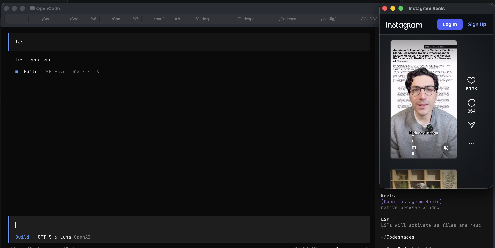

# OpenCode Instagram Reels

A macOS companion browser launched from the OpenCode TUI sidebar. It opens
Instagram Reels in a native `WKWebView` window and keeps login cookies between
launches.



The browser is intentionally a separate native window. OpenCode's terminal TUI
cannot host an interactive WebKit view inside its character buffer.

## Requirements

- macOS 13 or newer
- Xcode Command Line Tools
- OpenCode 1.17 or newer with TUI plugin support

## Install

From a checkout of this repository:

```sh
./install.sh
```

The installer:

- builds `opencode-reels-browser`
- installs it to `~/.config/opencode/bin`
- installs the TUI plugin to `~/.config/opencode/plugins`
- registers the plugin in `~/.config/opencode/tui.jsonc`

Fully quit and restart OpenCode, open a session, and click **Open Instagram
Reels** in the sidebar. The first launch may require signing in to Instagram.

## Build An App

Build a signed application bundle with:

```sh
./scripts/build-app.sh
```

The default signature is ad hoc and is suitable for local use. For distribution
with a Developer ID certificate, set `CODESIGN_IDENTITY`:

```sh
CODESIGN_IDENTITY="Developer ID Application: Example, Inc. (TEAMID)" \
  ./scripts/build-app.sh
```

## Development

Run the companion directly:

```sh
swift run opencode-reels-browser
```

Build the TUI plugin independently:

```sh
bun build opencode-reels.tsx \
  --target bun \
  --external "@opencode-ai/plugin/tui" \
  --external "@opentui/core" \
  --external "@opentui/solid" \
  --outdir /tmp/opencode-reels-plugin
```

## Project Layout

- `Sources/ReelsBrowser/main.swift`: native WebKit companion
- `opencode-reels.tsx`: OpenCode sidebar plugin
- `install.sh`: local installation and TUI registration
- `scripts/build-app.sh`: `.app` packaging and signing

## License

MIT. See [LICENSE](LICENSE).
